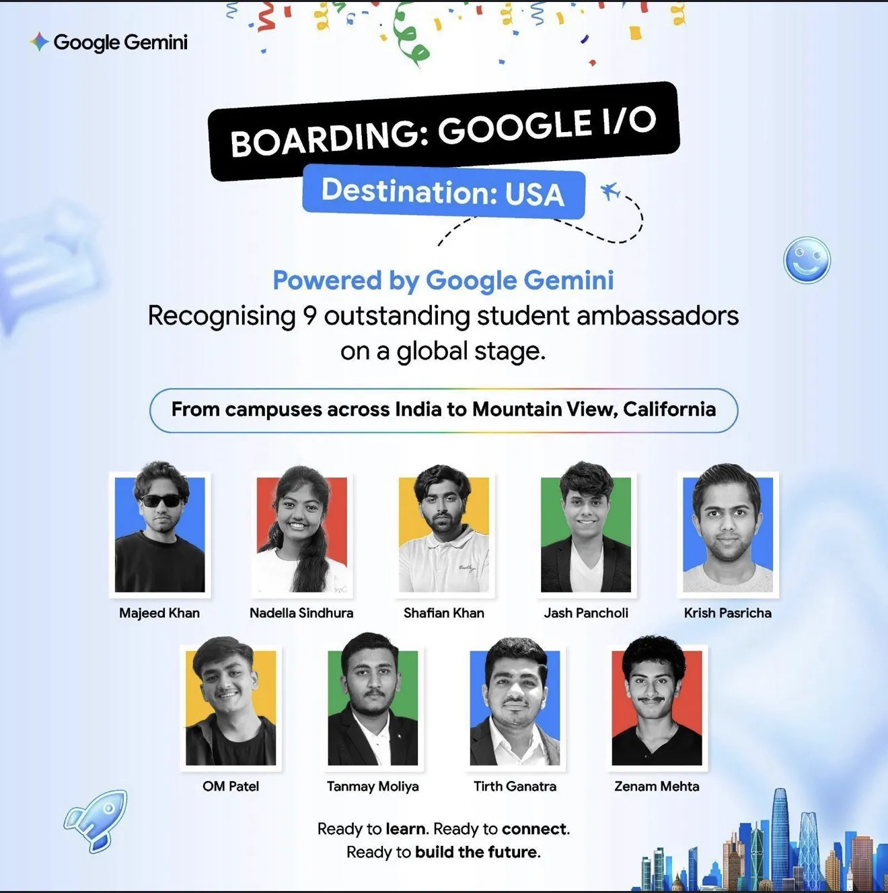
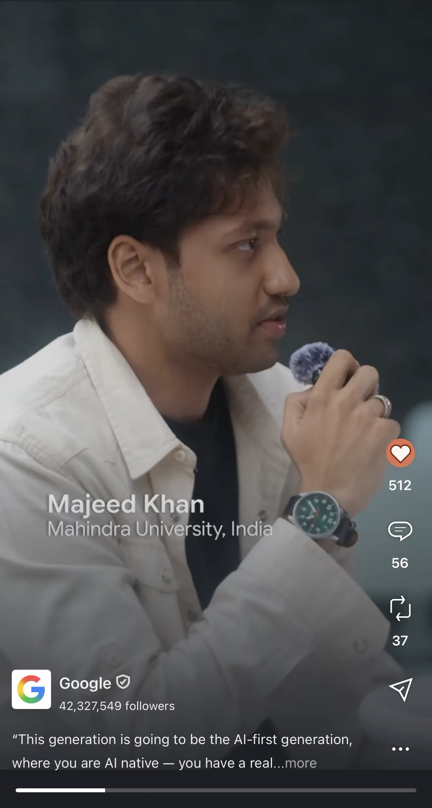
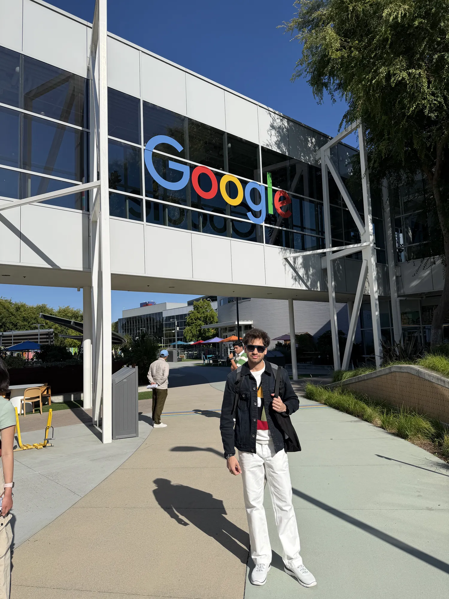

<div align="center">


</div>

<div align="center">

```
╔══════════════════════════════════════════════════════════════════════╗
║                                                                      ║
║   M O H A M M E D   M A J E E D   K H A N                            ║
║                                                                      ║
║   AI engineer · agentic systems · retrieval · on-device inference    ║
║   Hyderabad, India                                                   ║
║                                                                      ║
╚══════════════════════════════════════════════════════════════════════╝
```

**Two years ago I watched Google I/O from a laptop in Hyderabad.**
**This year I was on the other side of the screen, at Mountain View.**

[](https://github.com/Majeedkhan05)
[](https://github.com/Majeedkhan05)

[](https://majeedkhan.vercel.app)

[](https://medium.com/@majeedkhan2005.cc/inside-google-i-o-2026-what-changed-my-mind-about-the-future-of-ai-7d818d1c8960)
[](https://www.linkedin.com/in/majeed-khan-75ba72311/)
[](mailto:majeedkhan2005.cc@gmail.com)


<table>
<tr>
<td width="50%" align="center">

<br><sub><b>Google Gemini</b> — the nine flown to I/O. First name on the list.</sub>
</td>
<td width="50%" align="center">

<br><sub><b>@Google</b> · 42.3M followers — <i>"you are AI native"</i></sub>
</td>
</tr>
<tr>
<td width="50%" align="center">

<br><sub>Interviewing <b>Robby Stein</b>, VP of Product, Google Search</sub>
</td>
<td width="50%" align="center">

<br><sub><b>Googleplex</b>, Mountain View — May 2026</sub>
</td>
</tr>
</table>

</div>

---

## → [The site](https://majeedkhan.vercel.app)

An orbital hero rendered in WebGL, a **voxel world** you walk around to get to know
me, the Robby Stein interview, and every project with its numbers. Built by hand —
no framework, no build step, three.js vendored locally.

[**Open it →**](https://majeedkhan.vercel.app) · [source](https://github.com/Majeedkhan05/majeed-portfolio)

---

## The short version

I build AI systems that **finish what they start** — agents that orchestrate real
tools, retrieval that cites its sources, and models small enough to run where the
data already lives.

- 🇺🇸 **Google I/O 2026 Delegate** — one of **9** student ambassadors chosen from every campus in India, flown to Mountain View
- 🥇 **Rank #1 in India** — Google Cloud GenAI Exchange, out of **208,000+** developers, for Vertex AI and LLM implementation
- 🎙️ **Interviewed Robby Stein**, VP of Product for Google Search, on Gemini in search — 1 of 2 selected from India. Featured across [@Google](https://www.instagram.com/google) (42.3M), Google for Developers, and Google India
- 🧠 **Founder & President, AI Hub** @ Mahindra University — 100+ members, a 1,000-participant hackathon
- 🎓 Integrated M.Tech, Computer Science — Mahindra University, 2023 → 2028

---

---

## Stack

<div align="center">


</div>

<div align="center">


</div>

## What I've shipped

### [True North](https://github.com/Majeedkhan05/true-north) · bilingual AI back-office for Canadian insurance

Email lands → a policy PDF is parsed, confidence-scored, validated against Quebec
regulation → a bilingual draft the broker approves in one click. Multi-tenant,
billed, audited.

| | |
|---|---|
| **98.4%** | extraction accuracy across FR/EN binders |
| **58/58** | end-to-end checks passing, 0 failures — `python test_flow.py` |
| **0** | PII leakage · AMF · Loi 25 · PIPEDA |

`FastAPI` `Gemini` `Supabase RLS` `Stripe` `n8n` `Docker`

> Runs fully offline in `DEMO_MODE`. Clone it and the suite passes on your machine.

### [Indus Valley AI](https://github.com/Majeedkhan05/indus-valley-ai) · private multimodal RAG

A research assistant for a **4,000-year-old undeciphered script**, running entirely
on one machine. No cloud, no egress, no API bill.

| | |
|---|---|
| **1,500+** | academic chunks indexed — FAISS + BGE |
| **<200ms** | edge inference — Phi-3 Mini, LoRA fine-tuned |
| **IVA-80** | benchmark for factual grounding + red-team analysis |

`PyTorch` `FAISS` `CLIP` `Ollama` `LoRA` `Python`

> Ships with a formal research manuscript — *unpublished preprint, prepared for ICLR*.

### Paper Discovery Engine · multimodal RAG over dense academic PDFs

Figures and tables are where findings actually live, and most retrieval throws them
away. This one parses and indexes them. **~80% reduction** in literature search latency.

`Vertex AI` `Gemini` `Vector Search` `GCP`

---

## Toolkit

```
Languages    Python · C++ · Java · TypeScript · JavaScript · SQL
AI / ML      PyTorch · LangChain · FAISS · Gemini API · Vertex AI · Ollama
             Multimodal RAG · BGE + text-embedding-004 · OpenAI CLIP · LoRA
Cloud        GCP · Docker · Supabase (Postgres RLS) · FastAPI · Linux · n8n
Focus        agent orchestration · retrieval · latency · privacy-preserving AI
```

---

---

## The numbers

<div align="center">


</div>

### Contribution snake

<div align="center">

<picture>
  <source media="(prefers-color-scheme: dark)" srcset="https://raw.githubusercontent.com/Majeedkhan05/Majeedkhan05/output/snake-dark.svg" />
  <source media="(prefers-color-scheme: light)" srcset="https://raw.githubusercontent.com/Majeedkhan05/Majeedkhan05/output/snake-light.svg" />
  
</picture>

<sub>Regenerated every 12 hours by GitHub Actions.</sub>

</div>

## Writing

**[Inside Google I/O 2026: What Changed My Mind About the Future of AI](https://medium.com/@majeedkhan2005.cc/inside-google-i-o-2026-what-changed-my-mind-about-the-future-of-ai-7d818d1c8960)**
*Medium · 1 Jun 2026 · 4 min*

> The conversation wasn't centered on prompts. It was centered on orchestration.
>
> **Access is no longer the differentiator. Execution is.**

---

<div align="center">

### Currently looking for remote AI engineering internships

**[majeedkhan2005.cc@gmail.com](mailto:majeedkhan2005.cc@gmail.com)**

[Website](https://majeedkhan.vercel.app) · [LinkedIn](https://www.linkedin.com/in/majeed-khan-75ba72311/) · [Medium](https://medium.com/@majeedkhan2005.cc)

<sub>Hyderabad, India · open to remote worldwide</sub>

</div>
